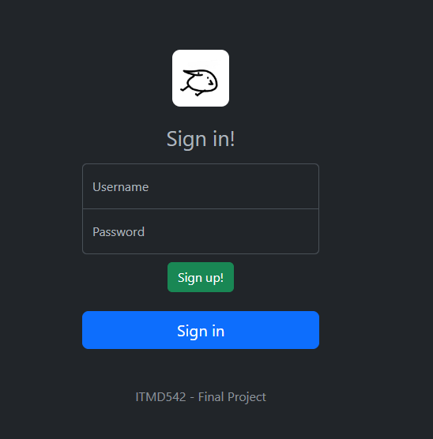
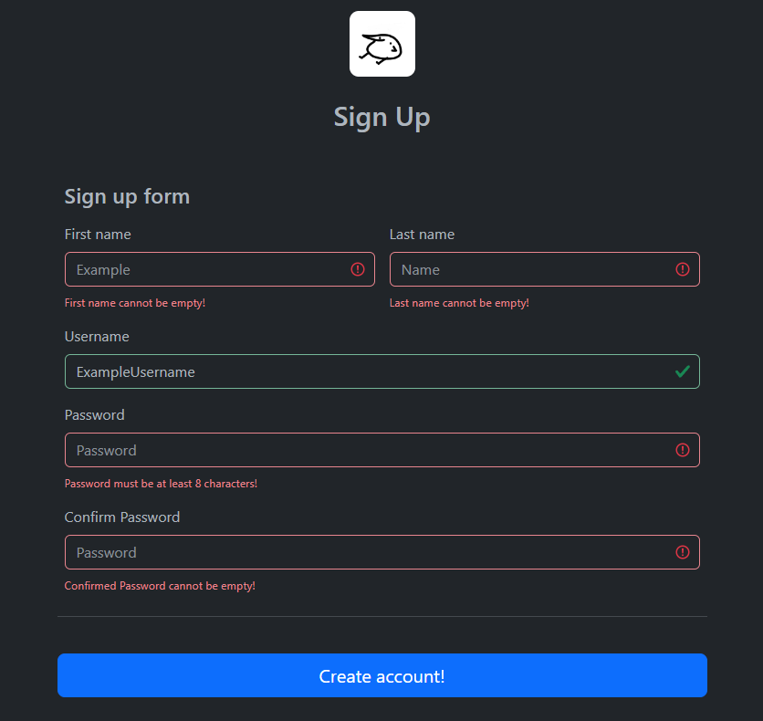
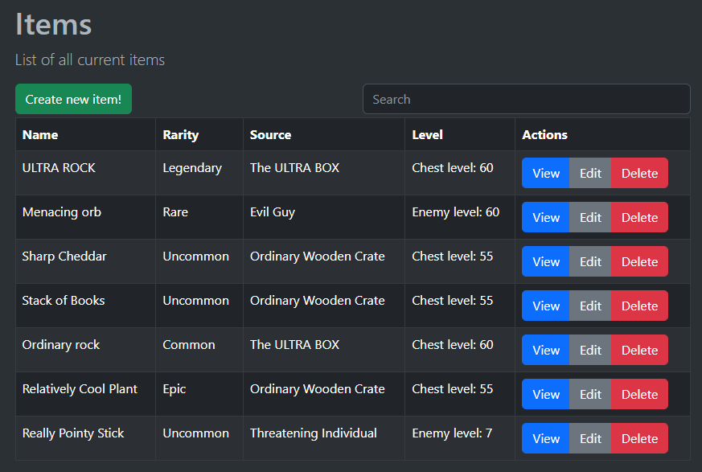
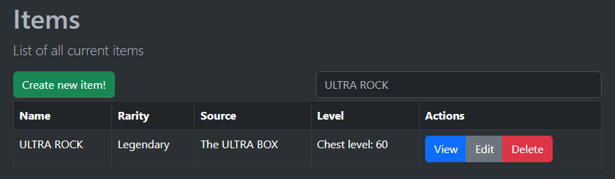
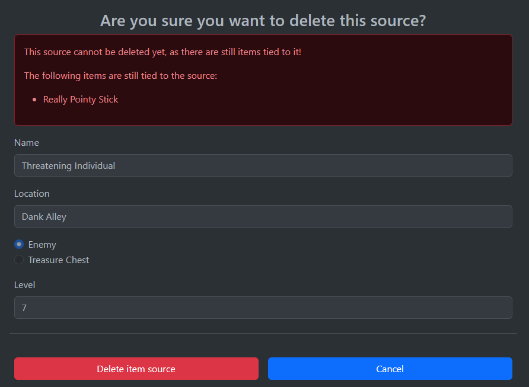
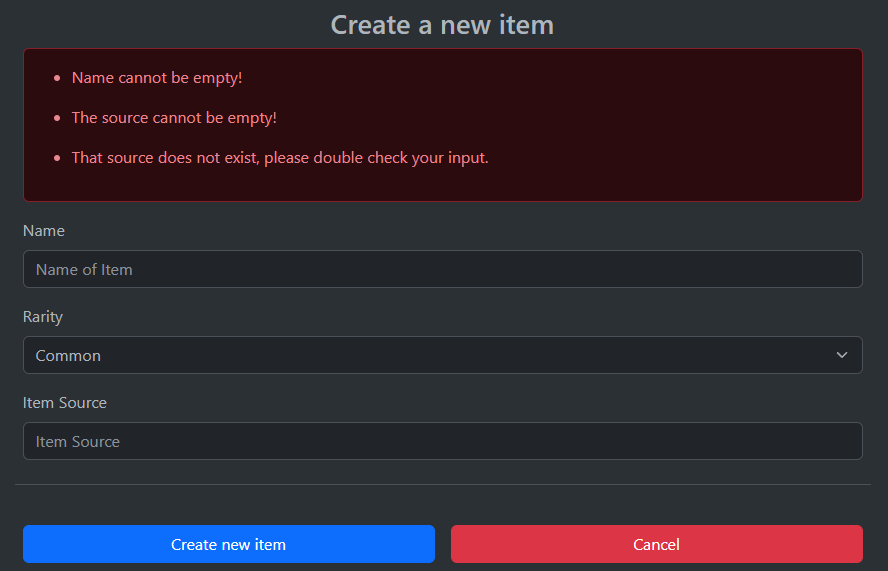
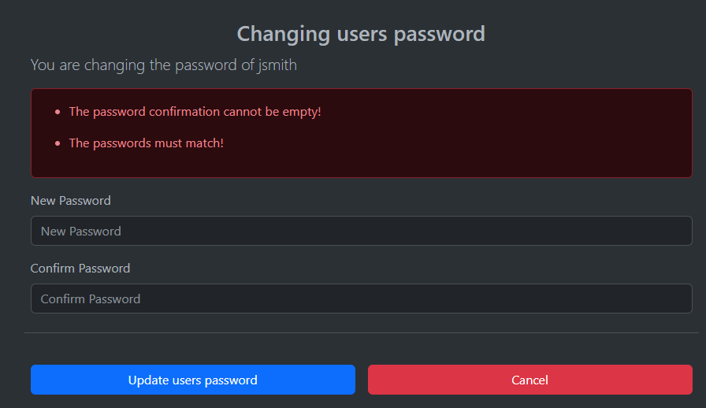
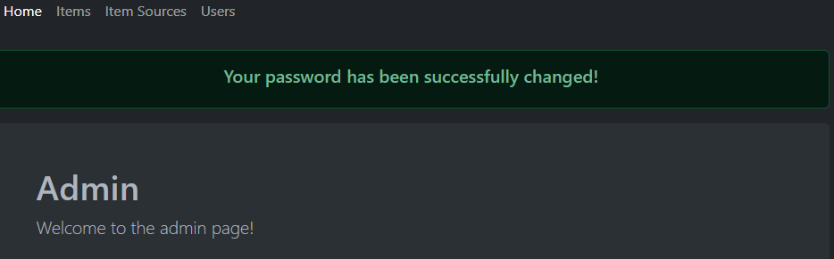
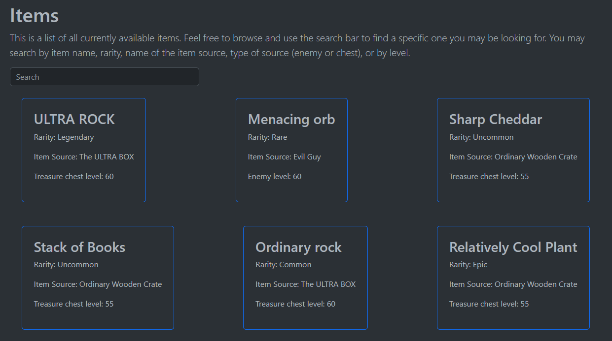

# ITMD 542 Final Project

## Aleksandar Kamenovic | akamenovic(at)hawk.iit.edu

 Project repository: https://github.com/Pengu07/ITMD542/tree/main/Final%20Project

### Project Description
This project is based on a fictional game-like environment. There are 3 main database collections. Accounts, Items, and Item Sources.

The accounts collection is for each individual user and their information. It also denotes whether the user has the admin role or not. The item sources collection is a collection of all potential sources that items can come from. The items collection has all the items within it. Along with what source they come from.

Admins are able to perform all major CRUD operations on the collections. Creating, reading, updating, deleting. With the additional ability to reset users passwords as well.

When a user is logged in they are able to change their own password by clicking the icon in the top left. Which is also where you click to be able to sign out. All the routes are protected with passport.js and you need to be authenticated at all times to be able to access the app and do anything.

If the user is a default user, and not an admin, when they log in they only see the home page and the items page. The items page is different for users though, and instead they get a list of all possible items but instead of it being in a table, is individual boxes. 

Every page that has a list of data in it has a search bar available to be used to filter results and find a specific one you may be looking for.

### Development environment

This was made on Windows using Visual Studio Code

* Node version: 18.15.0
* NPM version: 9.6.5
* Bootstrap: 5.3.0

### Installation/Running Instructions

Once you have cloned the repository, change directory into the Final-Project folder. This is the root folder of the project. Inside this folder, place the .env file. (I think blackboard changes its name so rename it to just .env with no other text). At this point you are then able to run the command `npm install` in your terminal to install all the needed modules. Once that is finished, you are then able to run npm run start to start the app. At which point you are then able to visit it at localhost:3000.

Once you are on the websites login page you have two options. 

1. You can login as an admin with the credentials: Username: admin, Password: adminadmin
2. Sign up and create a new user and log in with that user

If you log in as an admin, you will be able to perform all the major CRUD operations and see all the information displayed. If you log in as a user, you can see all the items that are currently in the items collection in its entirety.

### Insights and Results

In general, I think this project was a good experience. As it was mainly putting together everything we've learned throughout the semester. I was able to get everything I thought of working. Although, I still have ideas of more features I could add, but I think that would start going beyond the scope of the project. I had a few challenges, mainly with working stuff I was unfamiliar with. Ill provide citations on where i learned about those at the end of the document. 

One of the big things I learned while working on this app was working with passport.js. I felt like once I understood how it worked it really made the authentication a relatively simple thing to implement and have persist and protecting routes as the app grew.

These are some screenshots that show the app in action:

The login page

The signup page when invalid data is input

The full items table when viewed as an admin

The items table when a specific item is searched for

A failed deletion on an item source as it still had items tied to it

Trying to create a new item with invalid data

Trying to change a users password with one that doesnt meet guidelines

Success page when you successfully change your own password

All the items available when viewed as a default user

### References

These pages are where I learned more about how to use the cryptobkdf2password command:

https://nodejs.org/api/crypto.html#cryptopbkdf2password-salt-iterations-keylen-digest-callback

https://www.geeksforgeeks.org/node-js-crypto-pbkdf2-method/

I followed passports tutorial on setting up local authentication as found here:

https://www.passportjs.org/tutorials/password/

This page is how I figured out an issue I was having when I was trying to select by ID in mongodb:

https://stackoverflow.com/questions/56770111/find-a-document-by-id-in-nodejs-mongodb

This page is where I learned the basics of how to make a filter/search bar:

https://www.w3schools.com/howto/howto_js_filter_table.asp